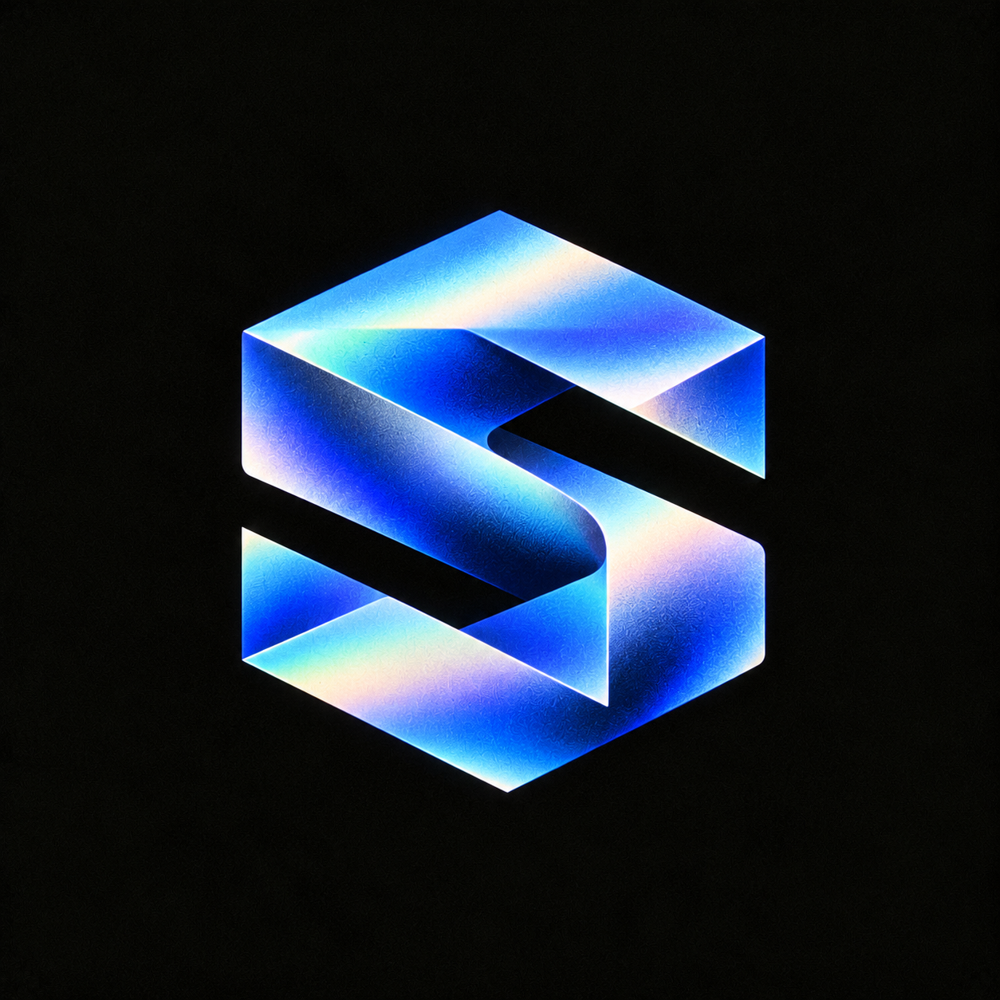

  
  
  <h1>SyberLabs</h1>
  
<strong>Software and research for reading, adaptive systems, and AI.</strong>

## RISE and Jev

**[RISE](https://github.com/SyberLabs/RISE)** is a live browser reader for text, time, image, and sound. Readers can present the same source in Stream or Page and control the pace and presentation. [Open RISE](https://rise.syberlabs.io/) · [See the project](https://syberlabs.io/projects/rise/)

**Jev** is TypeSafe AI's model, which we are evaluating independently. In RISE's Scriptorium, an optional **Route with JEV** action recommends a composition format from a typed request. Readers supply their own API key for that action. RISE still examines and admits the resulting reading through its own code. Chamber reading and pacing run locally without a model call or provider key. We have not verified a live provider outcome for the routing flow. [How we are evaluating Jev](https://syberlabs.io/jev/)

---

## Selected work

| Project | What it is |
| --- | --- |
| **[Relay](https://github.com/SyberLabs/relay)** | An application workspace in an invited pilot. People approve exact wording and control submissions. |
| **[OSAHR](https://github.com/SyberLabs/OSAHR_Cell)** | A Python kernel for stochastic, adaptive rewriting of typed hypergraphs with event replay. |
| **[OmniOS](https://github.com/SyberLabs/OmniOS)** | A canvas connecting live information sources to AI personas with inspectable context. |
| **[Papers](https://github.com/SyberLabs/papers)** | Research projects with clear status, claim limits, and reproduction steps. |

---
## People

- [Mateo Robles](https://github.com/sykosyber) — product, HCI, machine learning, and systems
- [Seth Carlson](https://github.com/sdcarlson) — Relay lead engineer; systems work on RISE and OSAHR

[**syberlabs.io**](https://syberlabs.io/) · [**Email**](mailto:syberlabs.software@gmail.com)
